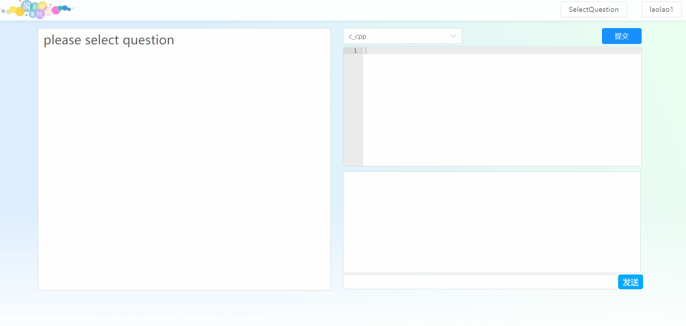
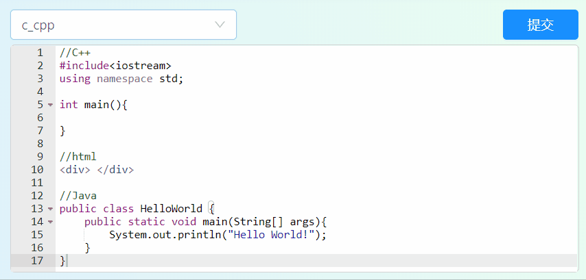
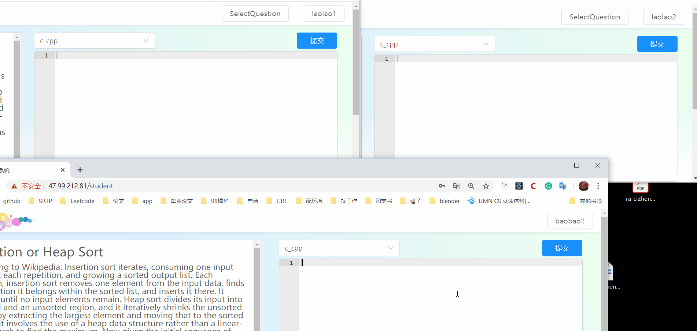
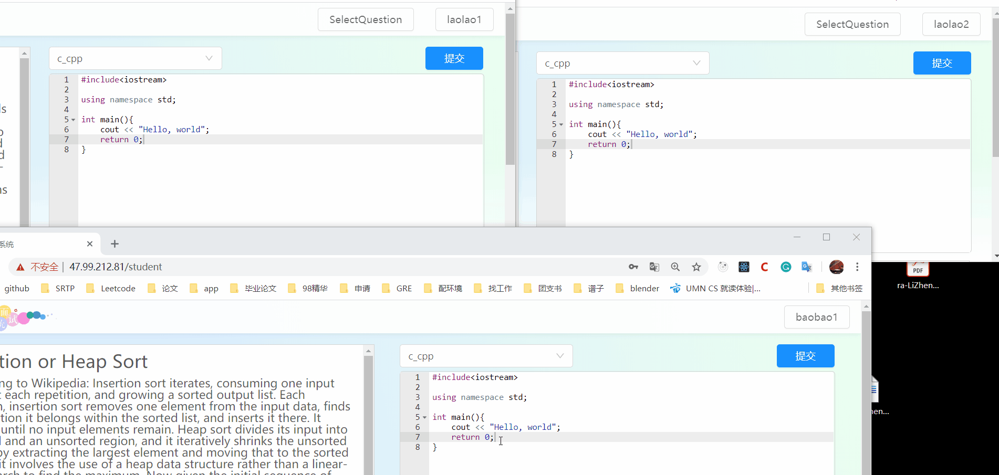
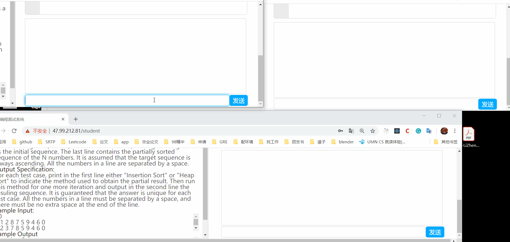

This repository is the frontend of a programming interview system. 

* This video shows how to use the programming interview system: https://www.youtube.com/watch?v=Qg42OakU8HQ&t=1s
* You can visit the system online at http://47.99.212.81
* The backend of the system is at https://github.com/zjulzy/Livecode_backend

This programming interview system supports following functions:

* It supports one job hunter and two interviewers online.

| username | password | identity   |
| -------- | -------- | ---------- |
| laolao1  | 123      | interview  |
| laolao2  | 123      | interview  |
| baobao1  | 123      | job hunter |

* Interviewers can select questions, and the job hunters' screens will show the question.

* highlight code

* interviews see what code the students write

* Even the selection of the code show to the interviewers

* A simple chat function

